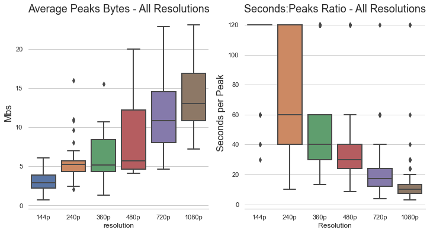
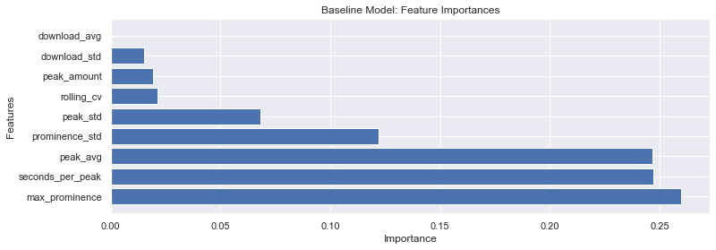
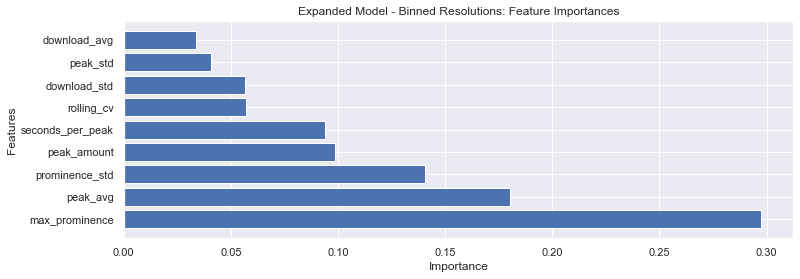

# Demo Our Model
[Model Website](https://res-recovery.herokuapp.com/)

# Project Motivation

Virtual private networks, or VPNs, have seen a growth in popularity as more of the general population has come to realize the importance of maintaining data privacy and security while browsing the Internet. VPNs route their users’ network traffic data through their own private servers, allowing them to provide these users with extra anonymity and protection by disguising the details of their network activity. However, even with the loss of detail such as packet destination, user activity in a VPN tunnel is still identifiable.

Over the last ten weeks, we have built a classifier that is able to identify the resolution/quality of a YouTube video while in a VPN tunnel. Our model is an extension of a previous binary classifer that was able to determine if a user was streaming video or not while in a VPN tunnel.

We hope that this tool will prove useful to ISPs as it may help in the diagnosing process. For example, if customer were to experience slow service such as video stuttering, it could be a simple misunderstanding of what the customer's current service is capable of handling. Knowing the requirements for smooth video playback at different resolutions will also help temper expectations when customers select different levels of service.

# The Data

Network traffic data was collected via the Viasat provided script, [network-stats](https://github.com/viasat/network-stats). The script collects details such as bytes being sent to the server/to the local machine on a second and millisecond level of detail.

Our dataset is comprised of over 25 hours of network traffic of video playback from YouTube. YouTube was our primary source of video data as it allows full autonomy over video quality. The data collection process was also automated via a Selenium script developed by a group member. Our dataset includes video resolutions:

```python
video_resolutions: ["144p", "240p", "360p", "480p", "720p", "1080p"]
```

In the final iteration of our model, we grouped the resolutions to be:

```python
low_resolution: ["144p", "240p"]
medium_resolution: ["360p", "480p"]
high_resolution: ["720p", "1080p"]
```

Attempting to classify the exact numeric resolution proved to be difficult as factor such as user's network conditions or maximum bandwidth affect how data is transmitted. A user with a slightly lower bandwidth than a peer's may be able to stream 1080p with no interruptions but they may receive slightly small byte payloads slightly more often. However, we can see visually see when more resources are required at certain resolution thresholds.

When constructing our model, we chose to use 5 minute chunks as it was enough data to capture trends and behaviors over time while being robust to things such as the initial loading of video (this event typically results in a sudden influx on data, causing even low resolution to be mistaken as high resolution).

### Download Byte Stream

For our purposes, we primarily focused on the downloaded bytes stream. We saw that as resolution increases so does the frequency and magnitude of data. However, the magnitude of data being downloaded increases first and then the frequency. We use this knowledge to create some thresholding features to help set preliminary boundaries between resolutions.

Below is an example of what the downloaded byte stream looks like for a single video at six different resolutions. The data was collected by one user to ensure that network conditions would introduce any random noise.


### Peaks

A focus point of our model is looking at the large downloads being sent in a single second. Data peaks/spikes are defined as a large transaction of data in a single second. Large is relative to the resolution but we found that using a hard threshold of 5 megabits produced subsets of data where many features could be extracted. Much like before, we take some basic aggregate statistics to describe the magnitude and spread of the peaks. But the most useful feature in our model from this peaks data is the time between peaks. If we look back to the downloaded byte stream, we can see that there are much less peaks in the lower resolutions. Below are boxplots to help visualize the spread in average peak value as well as the seconds per peak ratio. Notice that these two features seem to have a negatively correlated relationship.



### Spectral Analysis

Much of our spectral features came from trying to characterize the resultant periodograms after applying Welch's method. [Network-stats](https://github.com/viasat/network-stats) allows analysis on a millisecond level, and in turn, allowing us to capture [higher frequency signals](https://en.wikipedia.org/wiki/Nyquist%E2%80%93Shannon_sampling_theorem). But, even at high resolutions, the most commonly observed frequency of the strongest signal lies between the .2Hz - .3Hz. As a result, we rebin our data to be samples spaced at 2 seconds.

In the graphic below, we can see that higher resolutions have much stronger signals being picked up by Welch's method than the lower resolutions.


# Features

Below is a list and summary of all the features we used in our model. Our features all follow the same theme of trying to characterize thresholds in the data to reflect the increased bandwidth requirement as resolution increases.

| Features         | Description                                                                                                                                                                                                                                                                                                                                                                    |
| :--------------- | :----------------------------------------------------------------------------------------------------------------------------------------------------------------------------------------------------------------------------------------------------------------------------------------------------------------------------------------------------------------------------- |
| download_avg     | The average bytes per second in the download direction.                                                                                                                                                                                                                                                                                                                        |
| download_std     | The standard deviation of the bytes in the download direction.                                                                                                                                                                                                                                                                                                                 |
| peak_avg         | The average byte amount of data peaks in the download direction. Peaks are defined as any single second transfer of data that is greater than 5 megabits.                                                                                                                                                                                                                      |
| peak_std         | The standard deviation of byte amount of data peaks in the download direction.                                                                                                                                                                                                                                                                                                 |
| peak_amount      | The total number of data peaks in the download direction.                                                                                                                                                                                                                                                                                                                      |
| seconds_per_peak | The ratio of seconds to peaks.                                                                                                                                                                                                                                                                                                                                                 |
| max_prominence   | Max prominence of the strongest signal in a periodogram (represented as the tallest peak in the graph). The frequency and power values are generated by applying Welch's methods on a 2 second resampled version of the data. Peaks in the periodogram are found by using SciPy's find_peaks method and the prominence values are calculated for data points considered peaks. |
| prominence_std   | In the periodograms, high resolution data generates well defined peaks while lower resolution does not. In our max_prominence feature, we calculate the prominence values for all the peaks found in the data. We simply run take the standard deviation of this array to create this prominence_std feature.                                                                  |
| rolling_cv       | Coefficient of variation taken over a rolling window version of the data                                                                                                                                                                                                                                                                                                       |

# Random Forest Models

We found that a Random Forest classifier performed best. The model is able to give a low, medium, and high label when fed output data from [network-stats](https://github.com/viasat/network-stats). Our efforts produced two classifers: a baseline and an extended model. The baseline was trained on a subset of the total training data - 240p, 480p, & 1080p. This was done to ensure that our features were good enough to atleast distinguish differences between resolutions spaced fairly far.

In both models, we trained on a 75/25 split on whatever subset of data we were using at the time.

## Baseline Model

The baseline model performed very well, achieving an accuracy of 91% as well as having no misclassifications greater than 1 class away. Below is a confusion matrix of our validation set. **Bold** is our model's predictions while _italics_ is the actual class. We included both the normalized and raw value.

|         | **240p**  | **480p**  | **1080p** |
| :------ | :-------- | :-------- | :-------- |
| _240p_  | 1.00 (18) | 0 (0)     | 0 (0)     |
| _480p_  | 0 (0)     | 0.85 (17) | 0.15 (3)  |
| _1080p_ | 0.02 (10  | 0.11 (2)  | 0.89 (17) |

A large percentage of our model can be explained with just max prominence, the seconds:peak, and the peak average. This suggests that these 3 resolutions are spaced out far enough in how many bytes they are sending that these 3 features are more than enough to explain the classification.



## Final Model

Since our baseline was able to achieve high accuracy, we proceeded to utilize the whole training set with all 6 resolutions. Remember that our classifier With very little hyperparameter tuning, our final model is able to achieve an accuracy 87%. More importantly, there are very few misclassifications that span beyond neighboring labels (e.g. only 1 high resolution was misclassified as low). There is 2-class jump misclassification where a high resolution clip is predicted as low resolution. Observing the data, there are scenarios where sometimes a small subsection of a high resolution data could resemble low resolution or even no video streaming. For example, when Youtube plays an ad, the server stops sending data during the duration of the ad and the level of network activity is greatly decreased. The confusion matrix below provides more detail as to where misclassification can happen.

Below is a confusion matrix of our validation set. **Bold** is our model's predictions while _italic_ is the actual class. We included both the normalized and raw value.

|          | **Low**   | **Medium** | **High**  |
| :------- | :-------- | :--------- | :-------- |
| _Low_    | 0.88 (29) | 0.12 (4)   | 0 (0)     |
| _Medium_ | 0.08 (3)  | 0.84 (33)  | 0.08 (3)  |
| _High_   | 0.02 (10  | 0.08 (3)   | 0.90 (35) |

From our 9 features, we see that max prominence is very influential in the model, followed by the peak average and the prominence standard deviation. We suspect that the large gaps between resolutions in power result in max prominence becoming very imporatnt in the final model.



# Discussion

For the future, one approach to extend our work would be to focus on more discriminant features that will help in the classification of specific resolutions. We could also include a larger variety of resolutions in our model such as 1440p or higher. Other interesting topics would center around how much information we can learn through the data. For example, analyzing the differences in the network traffic data for popular and unpopular YouTube videos or distinguishing the content type of a video (such as action vs. still) are topics that could be of interest as well.

Overall, we found it fascinating how much information we could gain about a user’s network activity even through a VPN. However, this also sparks the question of “how much information should we be able to know?” We must remember that VPNs are used to establish a sense of privacy and while these tools are created with the intention of ultimately fostering a better experience for the customer, it is important to keep ethical implications such as this in mind.
