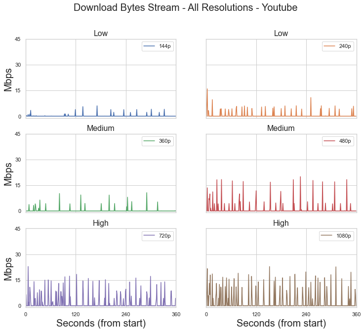
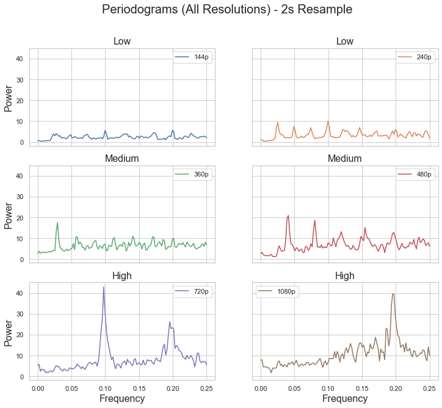

# Overview

Virtual private networks, or VPNs, have seen a growth in popularity as more of the general population has come to realize the importance of maintaining data privacy and security while browsing the Internet. VPNs route their users’ network traffic data through their own private servers, allowing them to provide these users with extra anonymity and protection by disguising the details of their network activity. However, even with the loss of detail such as packet destination, user activity in a VPN tunnel is still identifiable.

Over the last ten weeks, we have built a classifier that is able to identify the resolution/quality of video while in a VPN tunnel. Our model is an extension of a previous binary classifer that was able to determine if a user was streaming video or not while in a VPN tunnel.

# The Data

Network traffic data was collected via the Viasat provided script, [network-stats](https://github.com/viasat/network-stats). The script collects details such as bytes being sent to the server/to the local machine on a second and millisecond level of detail.

Our dataset is comprised of over 25 hours of network traffic of video playback from YouTube. YouTube was our primary source of video data as it allows full autonomy over video quality. The data collection process was also automated via a Selenium script developed by a group member. Our dataset includes video resolutions:

```python
video_resolutions: ["144p", "240p", "360p", "480p", "720p", "1080p"]
```

In the final iteration of our model, we grouped the resolutions to be:

```python
low_resolution: ["144p", "240p"]
medium_resolution: ["360p", "480p"]
high_resolution: ["720p", "1080p"]
```

Attempting to classify the exact numeric resolution proved to be difficult as factor such as user's network conditions or maximum bandwidth affect how data is transmitted. A user with a slightly lower bandwidth than a peer's may be able to stream 1080p with no interruptions but they may receive slightly small byte payloads slightly more often. However, we can see visually see when more resources are required at certain resolution thresholds.

### Download Byte Stream

For our purposes, we primarily focused on the downloaded bytes stream. We saw that as resolution increases so does the frequency and magnitude of data. However, the magnitude of data being downloaded increases first and then the frequency. We use this knowledge to create some thresholding features to help set preliminary boundaries between resolutions.


### Peaks

A focus point of our model is looking at the large downloads being sent in a single second. Large is relative to the resolution but we found that using a hard threshold of 5 megabits produced subsets of data where many features could be extracted. Much like before, we take some basic aggregate statistics to describe the magnitude and spread of the peaks. But the most useful feature in our model from this peaks data is the time between peaks. Visually, we can see that there are much less peaks in the lower resolutions, relating back to the observed lower frequency in lower resolutions.


### Spectral Analysis

Much of our spectral features came from trying to characterize the resultant periodograms after applying Welch's method. [Network-stats](https://github.com/viasat/network-stats) allows analysis on a millisecond level, and in turn, allowing us to capture [higher frequency signals](https://en.wikipedia.org/wiki/Nyquist%E2%80%93Shannon_sampling_theorem). But, even at high resolutions, the most commonly observed frequency of the strongest signal lies between the .2Hz - .3Hz. As a result, we rebin our data to be samples spaced at 2 seconds.


# Features

A key feature of our data is the increasing byte amount required to support increasing resolution. As you will see below, many of our features attempt to capture the increased bandwidth requirement. Below is a quick list and summary of all the features we used in our model.

| Features         | Description                                                                                                                        |
| :--------------- | :--------------------------------------------------------------------------------------------------------------------------------- |
| download_avg     | the average bytes per second in the download direction                                                                             |
| download_std     | the standard deviation of the bytes in the download direction                                                                      |
| peak_avg         | the average byte amount of data peaks in the download direction                                                                    |
| peak_std         | the standard deviation of byte amount of data peaks in the download direction                                                      |
| peak_amount      | the total number of data peaks in the download direction                                                                           |
| seconds_per_peak | the ratio of seconds to peaks                                                                                                      |
| max_prominence   | max prominence of peaks taken from a periodogram generated by applying Welch's methods on a 2 second resampled version of the data |
| prominence_std   | standard deviation of peak prominence; list of prominences generated from the same method as max_prominence                        |
| rolling_cv       | coefficient of variation taken a rolling window version of the data                                                                |

## Feature Importance

# Model

We found that a Random Forest classifier performed best. The model is able to give a low, medium, and high label when fed output data from [network-stats](https://github.com/viasat/network-stats). With very little hyperparameter tuning, our model is able to achieve an accuracy 88%. More importantly, there are very few misclassifications that span beyond neighboring labels (e.g. none of the low resolution was misclassified as high).
